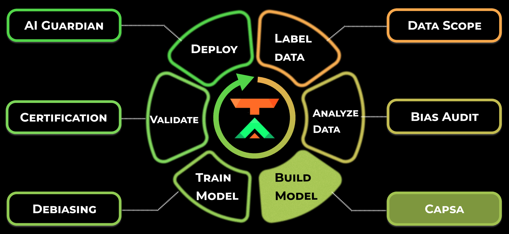

.. capsa documentation master file, created by
   sphinx-quickstart on Wed Jul  6 16:33:40 2022.
   You can adapt this file completely to your liking, but it should at least
   contain the root `toctree` directive.

Capsa Documentation
===================

.. toctree::
   :maxdepth: 1

   👋 Introduction <introduction/index.rst>
   💾 Installation <getting_started/installation.rst>
   ⭐️ Risk Metrics <risk_metrics/index.rst>
   🎬 Basic Usage <getting_started/basic_usage.rst>
   👩‍🏫 Tutorials <tutorials/index.rst>
   ‍💻 Metric Wrapper API <api_documentation/index.rst>
   🧿 Contribute <contribute/index.rst>

.. `capsa <https://github.com/themis-ai/capsa>`_ **is a data- and model-agnostic neural network wrapper for risk-aware ML workflows.**

`ThemisAI <http://themisai.io>`_'s mission is to transform technological innovation by creating robust and trustworthy AI for all. A critical component of achieving this is AI-awareness: building AI systems that can understand when they are biased, uncertain, or dealing with unreliable inputs.

.. **capsa** *(noun): latin root for a* **capsule** *or container.*

:abbr:`Capsa ((noun): latin root for a capsule or container.)` automatically wraps ML workflows to achieve risk-aware learning and deployment.

.. image:: assets/cycle-light.png
    :class: only-light

