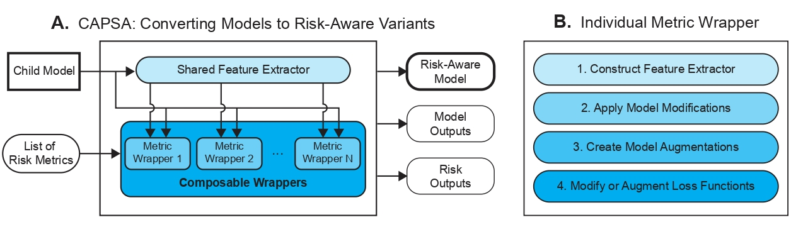

.. _introduction: 

Introduction
============
Large-scale deep neural networks (NNs) show extraordinary performance on complex problems. But they are also plagued by sudden, unexpected, and often catastrophic failures, particularly on challenging scenarios. Unfortunately, existing methods used to achieve risk-awareness of NNs are complex and require significant engineering changes. They are also developed only for particular settings, and are not easily composable.

**Capsa**, a flexible framework for extending models to become risk-aware, achieves this by providing two vital components that work together:

 **1.** Algorithmic implementations of state-of-the-art methodologies for quantifying risk.
 
 **2.** Composition of different algorithms together to quantify different risk metrics in parallel and minimize their impact on hardware resources.

What is Capsa?
++++++++++++++

.. image:: overview-dark.jpg
    :class: only-dark

**A.** Capsa converts a given neural network model into it's risk-aware variant. This new variant can simultaneously predict both it's output along with a list of user-specified risk metrics.

**B.** Each of these risk metrics act as a singular model wrapper, which is constructed through metric-specific modifications to the model architecture and loss function.

Feature Extractor
*****************

Capsa minimizes impact on hardware resources by constructing a feature extractor. This feature extractor refers to layers of the model that do not require any changes to support selected risk metrics, and therefore can be shared between them.

Both during training and inference, a forward pass initially happens through the feature extractor. The outputs of the feature extractor (in most cases, these refer to hidden layer outputs of the original model) are then passed to each of the risk metrics.
