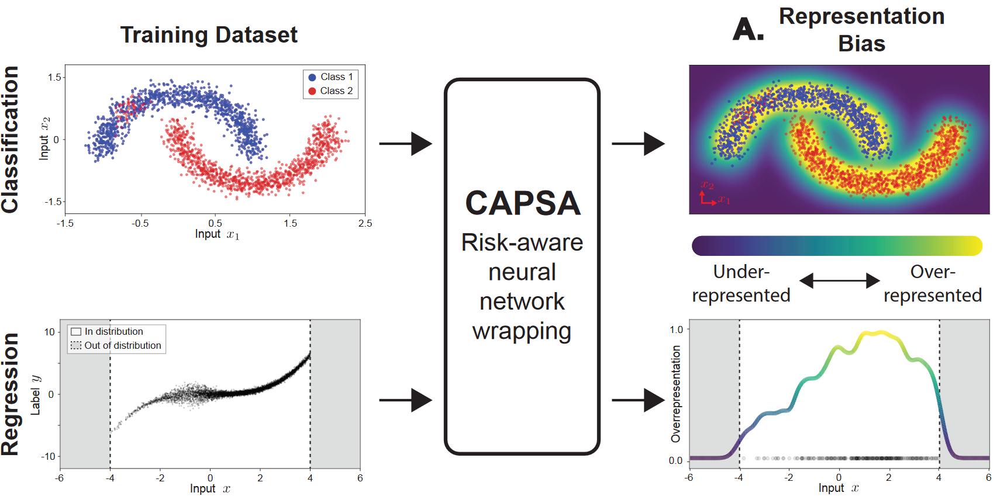
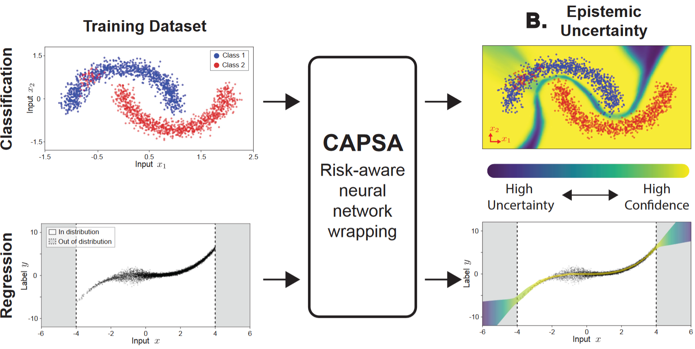
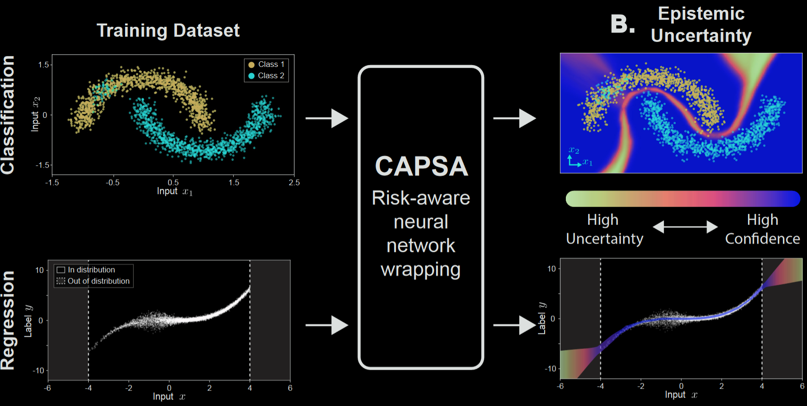
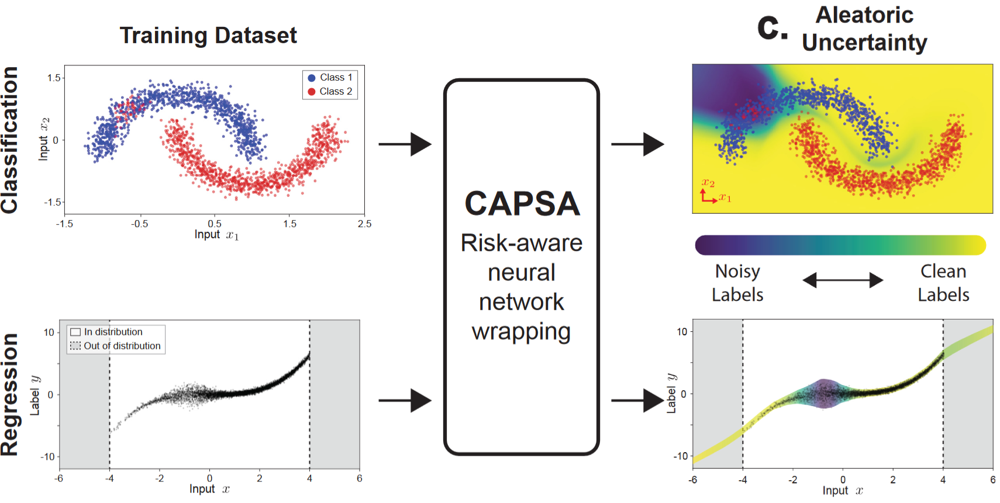
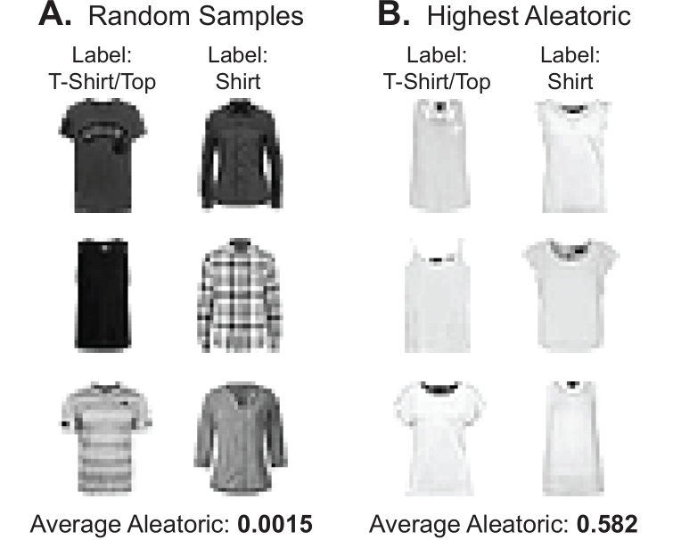
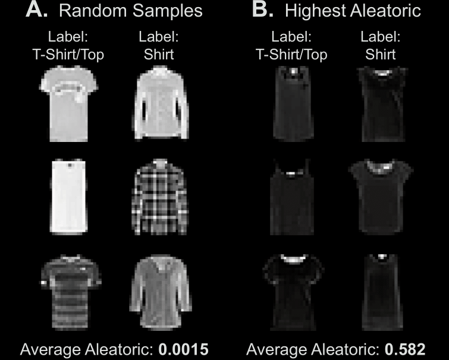

.. _risk_metrics: 

Risk Metrics
===============

Each risk metric uses different algorithms. Because of this, risk metrics are implemented via their corresponding wrappers. In **capsa**, we call these **Metric Wrappers**. These Metric Wrappers are implemented as objects that inherit from the **Base Wrapper** class, which itself inherits from the **Keras.Model**. This allows us to use the same workflow as a Keras model, but with the added functionality of the risk metrics.

Most Metric Wrappers have a similar workflow:

1.  **Initialize** the Metric Wrapper with the appropriate parameters.
2.  **Compile** the Metric Wrapper with optimizer, loss, metrics, etc. (Similar to a Keras model)
3.  **Fit** the Metric Wrapper to the data.

We can also treat our use a custom training loop to train the Metric Wrapper using tensorflow functionalities such as tf.GradientTape(). `Read more here <../getting_started/basic_usage.html>`_

Representation Bias
*******************

.. image:: bias-dark.PNG
    :class: only-dark

**Bias** of a dataset uncovers the imbalance in the feature space and captures whether certain combinations of features are more frequent than others. 
For example, it has been demonstrated the vast majority of open datasets for training autonomous vehicles comes from straight roads, good weather, and minimal traffic -- leading to a performance bias against other feature combinations that are commonly observed in reality (e.g., intersections, bad weather and visibility). It has also been demonstrated that machine learning algorithms can discriminate based on classes like race and gender. Joy Buolamwini and Timnit Gebru have `shown  <https://proceedings.mlr.press/v81/buolamwini18a.html>`_ that facial recognition algorithms are biased against darker-skinned faces.

Epistemic Uncertainty
*********************

This risk metric measures the uncertainty in the model's predictive process - this captures scenarios such as examples that are "hard" to learn, examples whose features are underrepresented, and/or out-of-distribution data.

For example, take a look at the classification figure above. What you'll see is that the model is very confident in its predictions for the majority of the data. However, there are a few examples that are very close to the decision boundary. These examples are the ones that are "hard" to learn. The model is uncertain about these examples, and therefore, we can say that the model is epistemically uncertain about these examples.

Aleatoric Uncertainty (Label Noise)
***********************************

.. image:: aleatoric-dark.png
    :class: only-dark

This risk metric captures noise in the data: mislabeled datapoints, ambiguous labels, classes with low seperation, etc.

For example, lets take a look at the Fashion-MNIST dataset, which containts two very similar classes: "tshirt" and "shirt". The following image shows the confusion matrix for a model trained on this dataset. As we can see, the model is very confused between these two classes. 

.. image:: confusion-light.PNG
    :class: only-light

.. image:: confusion-dark.PNG
    :class: only-dark

Now, let's inspect the samples that the model misclassifies. We can see that the average aleatoric uncertainty is higher among samples that are misclassified compared to samples that are correctly classified. Even we as humans have problems classifying samples with high uncertainty. Here are some examples:

Aleatoric uncertainty is irreducable, and cannot be reduced by adding more data, since it stems from the underlying data collection mechanism. The only solution is to improve data collection and labeling process. 

But epistemic uncertainty is something different. We can find less fundemental ways to reduce epistemic uncertainty. Usually, this type of uncertainty stems from model's limitations on learning the underlying distribution of the data. We can reduce this uncertainty by adding more data to better represent the data distribution, or by using a more complex model.